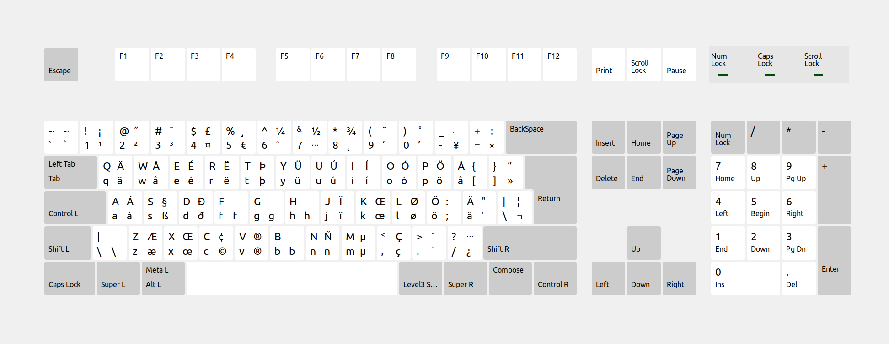

usse - Swedish keyboard layout based on US layout
=================================================

This is a Swedish keyboard layout based on the English US, intl., with AltGr
dead keys. Useful for when one want to switch between English and Swedish with
minimal difference in layout.



## How do I install this (Linux)?

- Add the contents of the file `se` to the end of
  `/usr/share/X11/xkb/symbols/se`
- Add the contents of the file `evdev.xml` to
  `/usr/share/X11/xkb/rules/evdev.xml`. It should be placed as one of the
  variants for Swedish, for example:

```
...
      <shortDescription>sv</shortDescription>
      <description>Swedish</description>
      <languageList>
        <iso639Id>swe</iso639Id>
      </languageList>
    </configItem>
    <variantList>
      <variant>
        <configItem>
          <name>nodeadkeys</name>
          <description>Swedish (no dead keys)</description>
        </configItem>
      </variant>
      <variant>
        <configItem>
          <name>usse</name>
          <description>Swedish (based on US, intl., with AltGr dead keys)
          </description>
        </configItem>
      </variant>
...
```

- Add the contents of the file `evdev.lst` to
  `/usr/share/X11/xkb/rules/evdev.lst`. It should be placed in the section `!
  variant`, for example:

```
...
  us_dvorak       se: Swedish (based on US Intl. Dvorak)
  usse            se: Swedish (based on US, intl., with AltGr dead keys)
  swl             se: Swedish Sign Language
...
```

Now you should be able to choose `usse` as a variant for the Swedish keyboard
layout (run for example `setxkbmap se usse`).

## Can I use this for the standard US layout (not intl. etc.)?

Yes, just change line 5 in file `se` to whatever you want to base your layout
on. For example, for the standard US layout, change it to `include "us(basic)"`.
